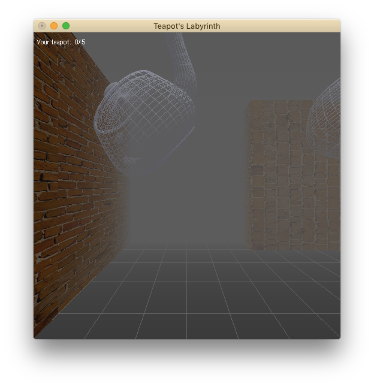
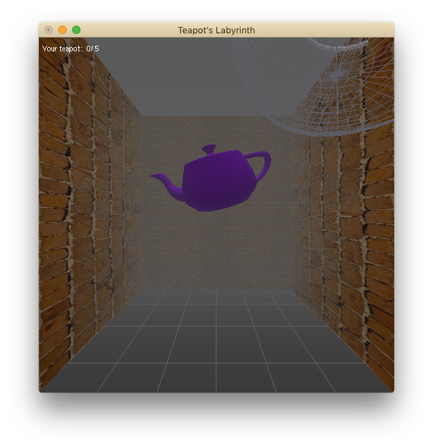

# やかんの迷宮
### OpenGLを使用した三次元プログラミング

## 実行の仕方
- 動きを確認した環境  
    OS High Sierra ver 10.13.1  

    計算機室のパソコンで最初の方に動くことは確認したのですが,最終的な乗艇では確認できていません...
- 実行コマンド
    Makefileにまとめてあるので
    > $  make

    と打ち込むとa.outができるので,
    > $  ./a.out

    で実行できます.

## ルール
** 色付きやかんを5個みつけたらゴールになります。**  
ワイヤーやかんは色付きやかんへと成長中の未熟なやかんなので、数には数えられません。
左上に遭遇したやかんの数が表示されています。
迷宮の中をひたすら移動し、やかんを5つ見つけてください。  
また、この迷宮は実行するたびに変わっていきます。  
  
色付きやかん  

## 操作方法
- 'R' or 'r' : 視界を右方向に移動
- 'L' or 'l' : 視界を左方向に移動
- ↑ の矢印キー : 前にが移動  
  迷宮に沿ってしか動けないようになっているので, いけないところに行こうとしても動けません.
- →, ←, ↓ の矢印キー : 矢印の方向に視界が向きます。  
周りの景色が似ていて, 若干位置関係がわかりにくくなるので注意してください。
  - → : 右を向きます.
  - ← : 左を向きます.
  - ↓ : 後ろを向きます.

## プログラムについて
かなりきたなくなってしまいました...  
自覚はあります.
- \* . java  
  テクスチャマッピングをするために使用. cで写真を読み込むのにかなりの時間を費やしたのだがうまくいかず, javaでRGBだけ抜き出してテキストファイルへと出力. CVの時のプログラムを参考にさせていただきました.
- main.cpp  
  ここでinitやらglutMainLoop()を実行したりしています.
- display.cpp  
  描画時に呼び出される関数の中身をここで定義.
  やかん, 文字, 地面, などの作成と、シーンによる切り替え.
- scene_*.cpp  
  それぞれのシーンの作成。
- keybord.cpp  
  キーボード入力を受けた際に作動する関数。
- warp.cpp  
  次のシーンへ行くための計算をする。

## 参考にさせていただいたサイト
  - [特定非営利活動法人 natural science](http://www.natural-science.or.jp/) さん
  - [床井研究室](http://marina.sys.wakayama-u.ac.jp/~tokoi/oglarticles.html) さん

### 困った時に...
- プログラムが完璧でなく, たまに変なところへ移動してしまいます. その場合は,終了してください...
- やかんが現れるのはランダムです. なかなか現れなくても根気強く巡ってみてください。
- 同じく, 迷宮もシーンをつなぎ合わせてランダムに作成されます. 一番最初に作成され, 道が変わることは(おそらく)ありません. なので行き止まりに何回入っても行き止まりになります.
- スタート地点から後ろに下がることはできません. 前に進めなくなったら、スタート地点に戻ってきた可能性があります。矢印キー(↓)を押して方向転換して見てください。
- なかなか曲がることができない場合は, 通路の真ん中にいるかどうか確認して見てください.
